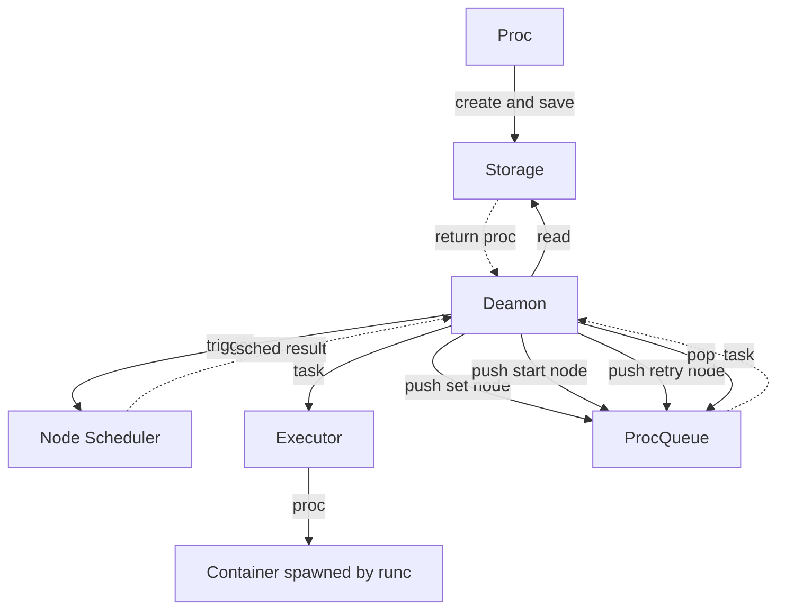

# Funny Nova

> Nova.



## Proc

```
type ProcPhase string

const (
  ProcPending ProcPhase = "Pending"
  ProcScheduled ProcPhase = "Scheduled"
  ProcRunning ProcPhase = "Running"
  ProcFailed ProcPhase = "Failed"
)

type Proc struct {
  UUID string
  Name string
  Command []string
  Env map[string]string
  CPU int64
  Memory int64

  Phase ProcPhase
  Image string
  Node string
  Message string
  RestartPolicy string
  RestartCount int

  CreatedAt time.Time
  UpdatedAt time.Time
}
```

## Storage

> Use Proc Data-Model

```
Insert(proc *Proc)

Delete(proc *Proc)

QueryByPhase(phase ProcPhase) []*Proc

QueryByNode(node string) []*Proc

Update(proc *Proc)
```

## Executor

```
Run(proc *Proc)

Kill(proc *Proc)
```

## Scheduler

```
SelectNode(proc *Proc) string
```

## ProcQueue

```
type TaskType string

const (
  TaskSetNode  TaskType = "SetNode"
  TaskStart    TaskType = "Start"
  TaskRetry    TaskType = "Retry"
  TaskRecycle  TaskType = "Recycle"
)

type Task struct {
  Type TaskType
  Proc *Proc
}

Push(task Task)

Pop() Task

Len() int
```
