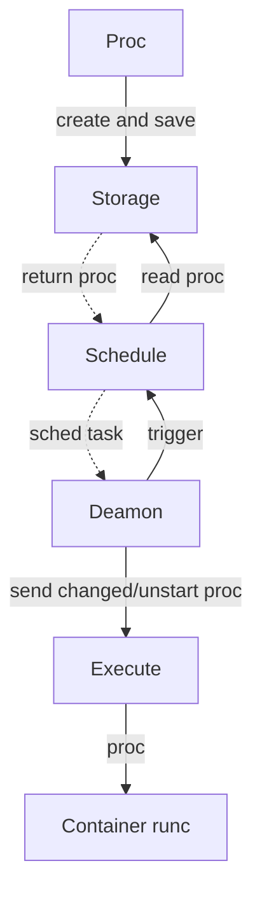

# Funny Nova

> Nova.

```mermaid
graph TB
  proc[Proc]
  sto[Storage]
  dea[Deamon]
  sched[Schedule]
  exec[Execute]
  cont[Container runc]

  proc -- create and save --> sto
  dea -- trigger --> sched
  sched -. sched task .-> dea
  sched -- read proc --> sto
  sto -. return proc .-> sched
  dea -- send changed/unstart proc --> exec
  exec -- proc --> cont

```

## 进程元信息

TODO

## 存储器

TODO

## 执行器

TODO

## 调度器

TODO
